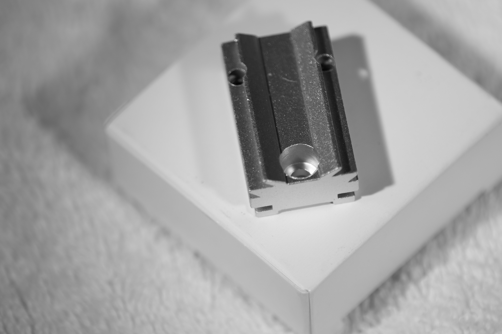
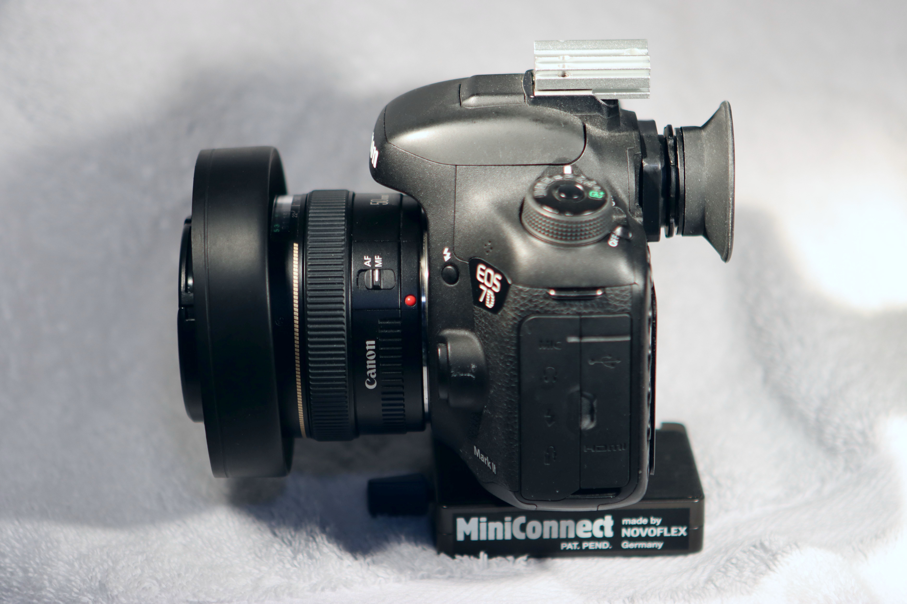

# Hot Shoe Dot Sight
 Red dot sight on Canon 7D or 90D via Astromania Silver Plate  

The Astromania Silver Plate appears to be simply a short chunk of aluminum extrusion
with holes drilled and 2 tapped for tiny dark sets screws.  
Those set screws are loose in the ziploc envelope with the extrusion  
best opened over a white towel.
That there is a market to justify manufacturing a custom extrusion for this purpose is great, IMO.  
The lower dovetail matches Picatinny rail.  
  

Any number of red dot reflex sights are available fitting Picatinny rails.
This one is among the more common low-cost lighter weight open versions:
  
Not that it would interfere with viewfinder access, even with an extended eyecup.  

Astromania's Silver Plate is shorter than a reflex sight's Picatinny dovetail clamp,
but need not resist recoil shocks in photographic usage.
 

Forehead clearance can be obtained by
* removing Silver Plate hot shoe flange material extending beyond the hot shoe  
    
* then flipping it around.  Those tiny dark set screws might vibrate loose   
  while sawing and/or grinding away that aluminum; better to remove them.

